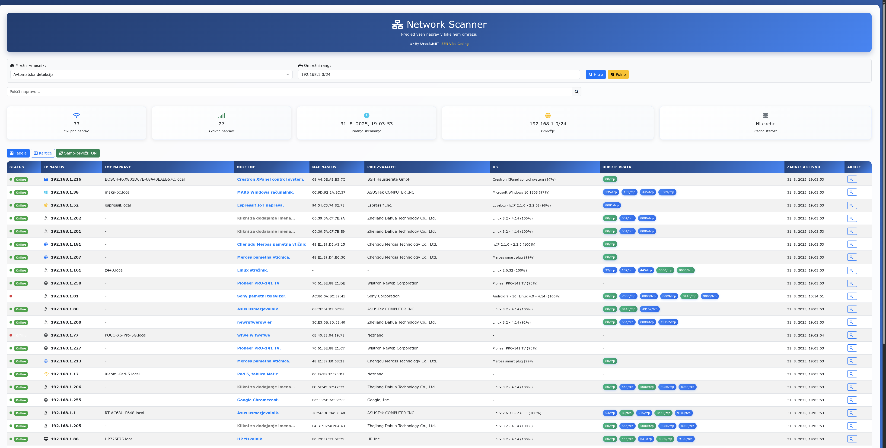
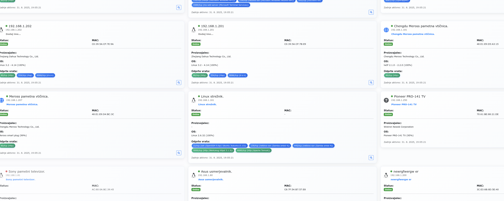
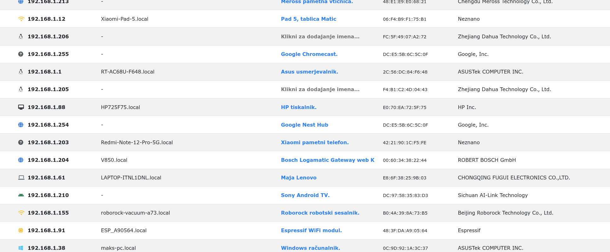
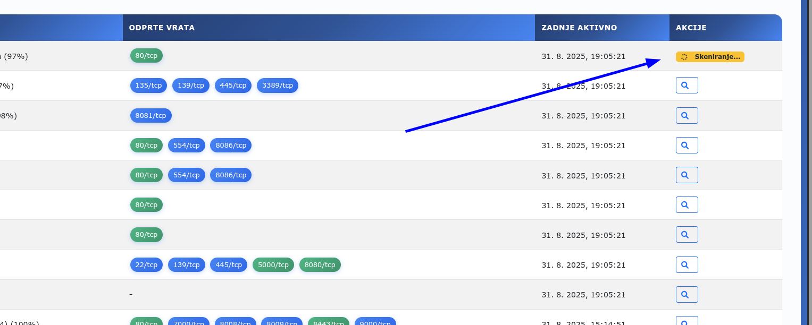

# 🌐 Network Scanner

<p align="center">
  
  
  
  
  
</p>

<p align="center">
  <strong>Advanced real-time network scanner with intelligent device recognition and beautiful web interface</strong>
</p>

<p align="center">
  <em>By <a href="https://www.urosk.net" target="_blank">Urosk.NET</a> - ZEN Vibe Coding</em>
</p>

---

## 📸 Screenshots

### Main Dashboard
*Modern interface with real-time device discovery and statistics*



### Device Cards View
*Beautiful card layout with device type recognition and automatic icons*



### Table View
*Comprehensive table view with detailed device information and actions*



### Real-time Scanning
*Live scanning indicator and manual rescan functionality*



---

## ✨ Key Features

### 🚀 **Real-time Network Discovery**
- **Continuous scanning** every 3 seconds for instant device detection
- **Combined ping + ARP scanning** for maximum device coverage
- **Aggressive TCP port probes** for reliable detection
- **Automatic detailed background scanning** for each discovered device

### 🧠 **Intelligent Device Recognition**
- **Automatic device categorization** (router, phone, printer, server, IoT...)
- **Smart icon detection** based on vendor, hostname, OS, and ports
- **Dynamic device descriptions** with vendor information and service count
- **Color-coded visualization** for quick visual recognition

### 🔍 **Advanced Network Analysis**
- **MAC address collection** from nmap results + system ARP table
- **OS fingerprinting** with nmap -A techniques  
- **Service detection** for all open ports with version information
- **Vendor identification** from MAC address ranges

### 💻 **Modern Web Interface**
- **Real-time updates** with auto-refresh functionality
- **Responsive Bootstrap 5 design** with professional styling
- **Dual view modes**: Table and Cards
- **Advanced search** across all device properties
- **Clickable port links** - direct access to web services
- **Custom device naming** with persistent storage
- **Manual rescan** functionality for individual devices

### 🐳 **Enterprise Ready**
- **Docker support** with root privileges for full functionality
- **SQLite database** for device history and persistence
- **RESTful API** for integration with other tools
- **Comprehensive error handling** and logging

---

## 🎯 Device Types & Icons

| Icon | Device Type | Detection Method |
|------|------------|------------------|
| 🍎 | **Apple Devices** | Vendor detection (iPhone, iPad, Mac) |
| 📱 | **Mobile Phones** | Hostname patterns, vendor info |
| 🖨️ | **Printers** | Port 631/9100, hostname patterns |
| 🌐 | **Routers** | Gateway IPs, network equipment vendors |
| 💻 | **Computers** | OS detection, hostname patterns |
| 🏠 | **IoT Devices** | Raspberry Pi, ESP, Arduino patterns |
| 🎮 | **Gaming Consoles** | PlayStation, Xbox, Nintendo detection |
| 📹 | **IP Cameras** | RTSP ports, security vendors |
| 💾 | **NAS/Storage** | SMB/NFS ports, storage vendors |
| 🖥️ | **Servers** | Web services, SSH access |

---

## 🚀 Quick Start

### Option 1: Docker (Recommended)

```bash
# Clone the repository
git clone https://github.com/your-username/network-scanner.git
cd network-scanner

# Run with Docker Compose
docker-compose up --build

# Open in browser
open http://localhost:5000
```

### Option 2: Local Installation

```bash
# Install system dependencies
sudo apt-get install nmap net-tools iputils-ping

# Install Python dependencies
pip install -r requirements.txt

# Run the application
python app.py

# Open in browser
open http://localhost:5000
```

---

## 🔧 Configuration

### Environment Variables
- `FLASK_ENV`: Set to `development` for debug mode
- `NETWORK_INTERFACE`: Specify preferred network interface
- `SCAN_TIMEOUT`: Adjust scanning timeout (default: 300s)

### Config File (`config.json`)
```json
{
  "preferred_interface": "",
  "last_network": "192.168.1.0/24", 
  "auto_refresh_enabled": true,
  "view_mode": "table",
  "scan_settings": {
    "timeout": 300,
    "top_ports": 1000
  }
}
```

---

## 📡 API Endpoints

| Endpoint | Method | Description |
|----------|--------|-------------|
| `/` | GET | Main web interface |
| `/api/scan` | GET | Trigger network scan |
| `/api/results` | GET | Get scan results |
| `/api/rescan-device` | POST | Rescan specific device |
| `/api/update-device-name` | POST | Update custom device name |
| `/api/interfaces` | GET | List network interfaces |
| `/api/config` | GET/POST | Configuration management |

### Example API Usage

```bash
# Trigger scan
curl "http://localhost:5000/api/scan?network=192.168.1.0/24"

# Get results
curl "http://localhost:5000/api/results"

# Rescan specific device
curl -X POST http://localhost:5000/api/rescan-device \
  -H "Content-Type: application/json" \
  -d '{"ip": "192.168.1.100"}'
```

---

## 🐳 Docker Configuration

### Dockerfile
```dockerfile
FROM python:3.11-slim

RUN apt-get update && apt-get install -y \
    nmap \
    net-tools \
    iputils-ping \
    gcc \
    python3-dev \
    build-essential \
    && rm -rf /var/lib/apt/lists/*

WORKDIR /app
COPY requirements.txt .
RUN pip install --no-cache-dir -r requirements.txt

COPY . .
EXPOSE 5000

CMD ["python", "app.py"]
```

### Docker Compose
```yaml
version: '3.8'

services:
  network-scanner:
    build: .
    network_mode: "host"
    privileged: true
    volumes:
      - ./data:/app/data
    environment:
      - FLASK_ENV=production
```

---

## 🔒 Security Considerations

### Permissions Required
- **Root privileges** recommended for full functionality (OS detection, MAC addresses)
- **Network access** to scan local network segments
- **Docker capabilities**: `NET_ADMIN`, `NET_RAW` for container deployment

### Security Best Practices
- Only scan networks you own or have permission to scan
- Use in trusted network environments
- Consider firewall rules for production deployment
- Regular security updates for dependencies

---

## 🛠️ Development

### Project Structure
```
network-scanner/
├── app.py                 # Main Flask application
├── templates/
│   └── index.html         # Web interface
├── requirements.txt       # Python dependencies
├── Dockerfile            # Docker configuration
├── docker-compose.yml    # Docker Compose setup
├── config.json           # Runtime configuration
├── devices.json          # Device cache
├── network_scanner.db    # SQLite database
└── README.md            # This file
```

### Local Development Setup
```bash
# Create virtual environment
python -m venv venv
source venv/bin/activate  # Linux/Mac
# venv\Scripts\activate   # Windows

# Install dependencies
pip install -r requirements.txt

# Run in development mode
export FLASK_ENV=development
python app.py
```

### Contributing
1. Fork the repository
2. Create a feature branch: `git checkout -b feature/amazing-feature`
3. Commit changes: `git commit -m 'Add amazing feature'`
4. Push to branch: `git push origin feature/amazing-feature`
5. Open a Pull Request

---

## 📊 Performance

### Scanning Speed
- **Initial discovery**: 3-5 seconds for /24 network
- **Detailed scanning**: 30-60 seconds per device (background)
- **Real-time updates**: 3-second intervals
- **Concurrent scanning**: Up to 300 parallel processes

### Resource Usage
- **Memory**: 50-100 MB typical usage
- **CPU**: Low impact with background threading
- **Network**: Minimal bandwidth usage
- **Storage**: SQLite database grows with device history

---

## 🐛 Troubleshooting

### Common Issues

#### "Permission denied" errors
```bash
# Run with sudo for full functionality
sudo python app.py

# Or use Docker with privileged mode
docker run --privileged --network host network-scanner
```

#### No devices detected
```bash
# Check network interface
ip route | grep default

# Verify nmap installation
nmap --version

# Test manual scan
nmap -sn 192.168.1.0/24
```

#### Docker networking issues
```yaml
# Use host networking in docker-compose.yml
services:
  network-scanner:
    network_mode: "host"
    privileged: true
```

### Debug Mode
```bash
# Enable detailed logging
export FLASK_ENV=development
export PYTHONPATH=$PWD
python app.py
```

---

## 📄 License

This project is licensed under the MIT License - see the [LICENSE](LICENSE) file for details.

```
MIT License

Copyright (c) 2024 Uroš Kostanjevec (Urosk.NET)

Permission is hereby granted, free of charge, to any person obtaining a copy
of this software and associated documentation files (the "Software"), to deal
in the Software without restriction, including without limitation the rights
to use, copy, modify, merge, publish, distribute, sublicense, and/or sell
copies of the Software, and to permit persons to whom the Software is
furnished to do so, subject to the following conditions:

The above copyright notice and this permission notice shall be included in all
copies or substantial portions of the Software.
```

---

## 🤝 Support & Community

- **🐛 Bug Reports**: [GitHub Issues](https://github.com/your-username/network-scanner/issues)
- **💡 Feature Requests**: [GitHub Discussions](https://github.com/your-username/network-scanner/discussions)
- **📧 Email**: [Your contact email]
- **🌐 Website**: [Urosk.NET](https://www.urosk.net)

---

## 🙏 Acknowledgments

- **nmap** - Network exploration and security auditing
- **Flask** - Lightweight web framework
- **Bootstrap** - Responsive web components
- **Font Awesome** - Beautiful icons
- **SQLite** - Embedded database engine

---

## ⭐ Star History

[](https://star-history.com/urkl/network-scanner&Date)

---

<p align="center">
  <strong>Made with ❤️ by <a href="https://www.urosk.net">Urosk.NET</a></strong><br>
  <em>ZEN Vibe Coding - Where technology meets elegance</em>
</p>